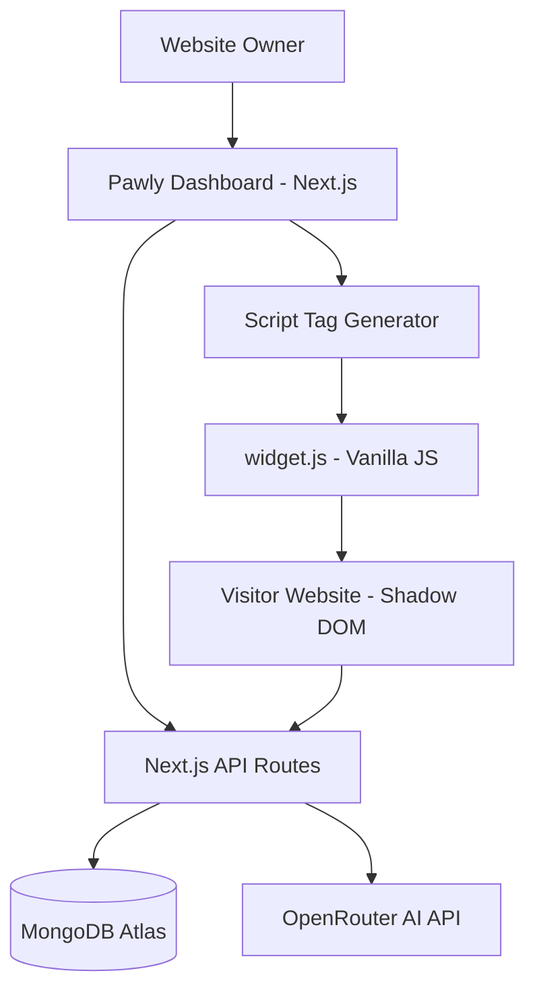

# Pawly AI — Development Plan

## 1. Architecture Overview



**Key Principle:** The widget is completely decoupled from the dashboard. It is a self-contained vanilla JS file that fetches settings and communicates with the API.

---

## 2. Tech Stack Decisions

| Layer | Technology | Reason |
|---|---|---|
| Dashboard UI | Next.js 14 App Router + Tailwind CSS | Fast, SSR-ready, easy deployment |
| Backend | Next.js API Routes | Co-located, no extra server needed |
| Database | **MongoDB Atlas** (Mongoose ODM) | Flexible schema, free tier, great with Next.js |
| Auth | **NextAuth.js v5** (Credentials + MongoDB Adapter) | No third-party SaaS dependency |
| AI | OpenRouter (GPT-4o-mini / Gemini Flash) | Cheap, flexible model switching |
| Widget | Plain Vanilla JavaScript | No framework needed, < 30KB target |
| Pet Animation | CSS Keyframes + SVG | Zero dependency, no Lottie needed for MVP |
| Deployment | Vercel | Free tier, auto-deploy from GitHub |

---

## 3. Folder Structure

```
pawly/
├── app/                          # Next.js App Router
│   ├── (auth)/
│   │   ├── login/page.tsx
│   │   └── signup/page.tsx
│   ├── (dashboard)/
│   │   ├── layout.tsx            # Sidebar layout
│   │   ├── dashboard/page.tsx    # Dashboard home
│   │   ├── pets/
│   │   │   ├── page.tsx          # List pets
│   │   │   ├── new/page.tsx      # Create pet
│   │   │   └── [petId]/
│   │   │       ├── page.tsx      # Edit pet settings
│   │   │       ├── knowledge/page.tsx
│   │   │       ├── actions/page.tsx
│   │   │       ├── install/page.tsx
│   │   │       ├── leads/page.tsx
│   │   │       └── chats/page.tsx
│   ├── api/
│   │   ├── auth/[...supabase]/route.ts
│   │   ├── pets/
│   │   │   ├── route.ts          # GET list, POST create
│   │   │   └── [petId]/
│   │   │       ├── route.ts      # GET, PUT, DELETE
│   │   │       └── settings/route.ts  # Public: GET pet config for widget
│   │   ├── chat/route.ts         # POST chat (public, used by widget)
│   │   ├── leads/route.ts        # POST lead capture (public)
│   │   ├── knowledge/
│   │   │   └── [petId]/route.ts  # GET/POST/DELETE knowledge items
│   │   └── actions/
│   │       └── [petId]/route.ts  # GET/POST/DELETE page actions
│   ├── (landing)/
│   │   └── page.tsx              # Landing page
│   └── layout.tsx
├── components/
│   ├── dashboard/
│   │   ├── Sidebar.tsx
│   │   ├── PetCard.tsx
│   │   ├── KnowledgeEditor.tsx
│   │   ├── ActionEditor.tsx
│   │   ├── ScriptTag.tsx
│   │   ├── LeadsTable.tsx
│   │   └── ChatHistory.tsx
│   ├── landing/
│   │   ├── Hero.tsx
│   │   ├── Features.tsx
│   │   ├── HowItWorks.tsx
│   │   ├── PricingSection.tsx
│   │   └── Footer.tsx
│   └── ui/                       # Shared UI primitives
│       ├── Button.tsx
│       ├── Input.tsx
│       ├── Card.tsx
│       └── Modal.tsx
├── lib/
│   ├── db/
│   │   └── mongoose.ts           # MongoDB connection singleton
│   ├── models/
│   │   ├── User.ts               # Mongoose User model
│   │   ├── Pet.ts                # Mongoose Pet model
│   │   ├── KnowledgeBase.ts      # Mongoose KnowledgeBase model
│   │   ├── PageAction.ts         # Mongoose PageAction model
│   │   ├── Conversation.ts       # Mongoose Conversation model
│   │   └── Lead.ts               # Mongoose Lead model
│   ├── auth.ts                   # NextAuth config
│   ├── openrouter.ts             # AI client
│   ├── prompt.ts                 # System prompt builder
│   └── utils.ts
├── hooks/
│   ├── usePets.ts
│   ├── useKnowledge.ts
│   └── useLeads.ts
├── types/
│   └── index.ts                  # All shared TypeScript types
├── public/
│   ├── widget.js                 # 🔑 The embeddable widget
│   ├── pets/                     # Pet SVG assets
│   │   ├── cat.svg
│   │   └── dog.svg
│   └── og-image.png
├── scripts/
│   └── seed.ts                   # Optional seed script for demo data
├── middleware.ts
├── .env.local
├── tailwind.config.ts
└── package.json
```

---

## 4. Database Schema (MongoDB / Mongoose)

```typescript
// lib/models/User.ts
const UserSchema = new Schema({
  name:         { type: String, required: true },
  email:        { type: String, required: true, unique: true },
  passwordHash: { type: String, required: true },
}, { timestamps: true });

// lib/models/Pet.ts
const PetSchema = new Schema({
  userId:          { type: Schema.Types.ObjectId, ref: 'User', required: true },
  name:            { type: String, default: 'Pawly' },
  petType:         { type: String, default: 'cat' },     // cat | dog | bunny
  brandColor:      { type: String, default: '#7C3AED' },
  greetingMessage: { type: String, default: 'Hi! 👋 I\'m here to help!' },
  personality:     { type: String, default: 'friendly' }, // friendly | professional | funny | calm
  position:        { type: String, default: 'bottom-right' },
  allowedDomain:   { type: String, default: null },
  isActive:        { type: Boolean, default: true },
}, { timestamps: true });

// lib/models/KnowledgeBase.ts
const KnowledgeBaseSchema = new Schema({
  petId:      { type: Schema.Types.ObjectId, ref: 'Pet', required: true },
  title:      { type: String, required: true },
  content:    { type: String, required: true },
  sourceType: { type: String, default: 'manual' },       // manual | faq
}, { timestamps: true });

// lib/models/PageAction.ts
const PageActionSchema = new Schema({
  petId:      { type: Schema.Types.ObjectId, ref: 'Pet', required: true },
  label:      { type: String, required: true },           // e.g. "Pricing"
  intent:     { type: String, required: true },           // e.g. "pricing"
  selector:   { type: String, required: true },           // e.g. "#pricing"
  actionType: { type: String, default: 'scroll_to' },     // scroll_to | highlight | open_link
  url:        { type: String, default: null },            // for open_link type
}, { timestamps: true });

// lib/models/Conversation.ts
const MessageSchema = new Schema({
  role:    { type: String, enum: ['user', 'assistant'] },
  content: { type: String },
  emotion: { type: String, default: 'idle' },
}, { _id: false });

const ConversationSchema = new Schema({
  petId:     { type: Schema.Types.ObjectId, ref: 'Pet', required: true },
  visitorId: { type: String, required: true },
  messages:  [MessageSchema],
}, { timestamps: true });

// lib/models/Lead.ts
const LeadSchema = new Schema({
  petId:     { type: Schema.Types.ObjectId, ref: 'Pet', required: true },
  visitorId: { type: String },
  name:      { type: String },
  email:     { type: String },
  phone:     { type: String },
  message:   { type: String },
}, { timestamps: true });
```

**Auth note:** NextAuth.js handles sessions via JWT stored in an httpOnly cookie. No MongoDB adapter needed for MVP — user data is stored in the `User` collection and NextAuth reads it on login.

---

## 5. API Design

### Public (Widget) Endpoints

| Method | Endpoint | Auth | Description |
|---|---|---|---|
| GET | `/api/pets/[petId]/settings` | None | Fetch pet config for widget |
| POST | `/api/chat` | None | Send message, get AI reply |
| POST | `/api/leads` | None | Submit lead capture |

### Protected (Dashboard) Endpoints

| Method | Endpoint | Auth | Description |
|---|---|---|---|
| GET/POST | `/api/pets` | Session | List / Create pets |
| GET/PUT/DELETE | `/api/pets/[petId]` | Session | Manage specific pet |
| GET/POST/DELETE | `/api/knowledge/[petId]` | Session | Manage knowledge base |
| GET/POST/DELETE | `/api/actions/[petId]` | Session | Manage page actions |

---

## 6. AI System Prompt Strategy

```
You are {petName}, a cute AI pet assistant living on the website of {businessName}.

Your ONLY job is to help visitors using the information below. Do NOT answer anything unrelated to this business or website.

=== BUSINESS KNOWLEDGE ===
{knowledgeBase}

=== PAGE SECTIONS I CAN GUIDE TO ===
{pageActions}
=== END ===

Rules:
- Answer ONLY using the knowledge above.
- Keep answers short (2-4 sentences max), friendly, and helpful.
- If the info is not available, say: "I'm not sure about that yet! Please contact the team directly."
- If the user asks for a section (pricing, menu, contact, etc.), include the relevant action.
- Respond in JSON: { "message": "...", "emotion": "happy|confused|thinking|idle", "action": null | { "type": "scroll_to|highlight|open_link", "selector": "...", "url": "..." } }
```

---

## 7. Widget Architecture (`widget.js`)

```
widget.js (Vanilla JS, ~25KB target)
│
├── Bootstrap
│   ├── Read data-pet-id from <script> tag
│   ├── Fetch /api/pets/{id}/settings
│   └── Initialize Shadow DOM container
│
├── PetRenderer
│   ├── Inject SVG pet character
│   ├── CSS keyframe animations (idle/happy/confused/thinking)
│   └── Handle click → open chat panel
│
├── ChatPanel
│   ├── Greeting message
│   ├── Suggested questions
│   ├── Message thread (visitor + Pawly)
│   ├── Input + Send button
│   └── Thinking animation
│
├── AIBridge
│   ├── POST /api/chat with message + visitorId
│   ├── Parse response (message + emotion + action)
│   ├── Trigger pet emotion change
│   └── Execute action
│
├── ActionExecutor
│   ├── scroll_to: document.querySelector(selector).scrollIntoView()
│   ├── highlight: add glowing CSS ring + remove after 3s
│   └── open_link: window.open(url)
│
└── LeadCapture
    ├── Detect lead collection trigger in AI response
    ├── Render lead form in chat panel
    └── POST /api/leads
```

---

## 8. MVP Task List (Phased)

### ✅ Phase 0 — Project Setup (Day 1 Morning)
- [ ] Init Next.js 14 project with Tailwind CSS
- [ ] Set up Supabase project + run migrations
- [ ] Configure environment variables
- [ ] Set up Supabase Auth (email/password + Google)
- [ ] Configure middleware for route protection

### 🎨 Phase 1 — Landing Page (Day 1 Afternoon)
- [ ] Hero section with animated demo pet
- [ ] Features section (3 key features)
- [ ] How it works (3 steps)
- [ ] Call to action (Get Started)
- [ ] Basic footer

### 🔐 Phase 2 — Auth (Day 1 Evening)
- [ ] Login page
- [ ] Signup page
- [ ] Middleware for protected routes
- [ ] Profile creation on signup

### 🐾 Phase 3 — Dashboard Core (Day 2)
- [ ] Dashboard sidebar layout
- [ ] Dashboard home (stats overview)
- [ ] Create Pet flow (name, color, greeting, personality)
- [ ] List pets page
- [ ] Pet edit settings page

### 🧠 Phase 4 — Knowledge & Actions (Day 2-3)
- [ ] Knowledge base editor (add/edit/delete entries)
- [ ] Page actions editor (label, intent, selector, type)
- [ ] Install page with copyable script tag

### 🤖 Phase 5 — AI Chat Engine (Day 3)
- [ ] `/api/pets/[petId]/settings` endpoint
- [ ] `/api/chat` endpoint with OpenRouter
- [ ] System prompt builder
- [ ] Response parser (message + emotion + action)
- [ ] Website-only guard

### 🦴 Phase 6 — Widget (`widget.js`) (Day 3-4)
- [ ] Shadow DOM bootstrap
- [ ] SVG pet character (cat) with CSS animations
- [ ] Idle / floating animation
- [ ] Chat panel HTML/CSS within shadow DOM
- [ ] Send message → get AI reply
- [ ] Emotion state changes (happy, confused, thinking)
- [ ] Action executor (scroll_to, highlight, open_link)
- [ ] Lead capture form in chat

### 📋 Phase 7 — Leads & Chat History (Day 4)
- [ ] `/api/leads` endpoint
- [ ] Leads table in dashboard
- [ ] Chat history page

### ✨ Phase 8 — Polish (Day 4-5)
- [ ] Pet animations fine-tuned
- [ ] Mobile responsiveness
- [ ] Error states and loading states
- [ ] Demo restaurant website for hackathon
- [ ] Pre-load demo pet config for demo

---

## 9. Environment Variables

```env
# MongoDB
MONGODB_URI=mongodb+srv://<user>:<pass>@cluster0.mongodb.net/pawly?retryWrites=true&w=majority

# NextAuth
NEXTAUTH_SECRET=<generate with: openssl rand -base64 32>
NEXTAUTH_URL=http://localhost:3000

# OpenRouter
OPENROUTER_API_KEY=
OPENROUTER_MODEL=openai/gpt-4o-mini   # or google/gemini-flash-1.5

# App
NEXT_PUBLIC_APP_URL=http://localhost:3000
```

---

## 10. Key Design Decisions

| Decision | Choice | Rationale |
|---|---|---|
| Database | MongoDB + Mongoose | Flexible schema, free Atlas tier, JSON-native |
| Auth | NextAuth.js v5 (JWT) | Simple credentials login, no external SaaS |
| Widget isolation | Shadow DOM | Prevents CSS bleed from host site |
| AI JSON mode | Structured output | Reliable emotion + action parsing |
| Public API auth | None (petId is the key) | Widget needs no user session |
| DB for conversations | Embedded messages array | MongoDB document model is perfect for this |
| Pet animation | CSS only | Zero deps, instant load |
| AI model | GPT-4o-mini via OpenRouter | Cheap + fast, good enough for FAQ |
| Domain guard | `allowed_domain` check in API | Prevent widget abuse |

---

## 11. Demo Plan (Hackathon)

Build a fake **"Bella's Bistro"** restaurant website with:
- `#hero` — welcome section
- `#menu` — food menu
- `#hours` — opening hours
- `#contact` — contact form
- `#booking` — reservation form

Pre-configure a Pawly pet with:
- Name: **Bella** 🐱
- Knowledge: menu items, hours, location, contact
- Actions: scroll to menu, scroll to contact, scroll to booking
- Personality: friendly
- Color: warm amber (#F59E0B)

Script demo flow is already defined in PRD Section 18.
